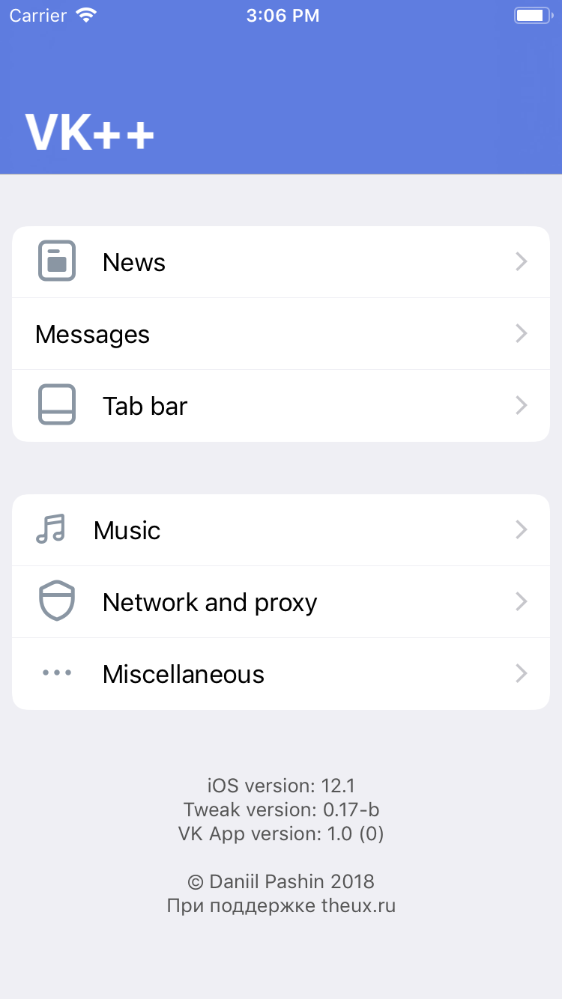
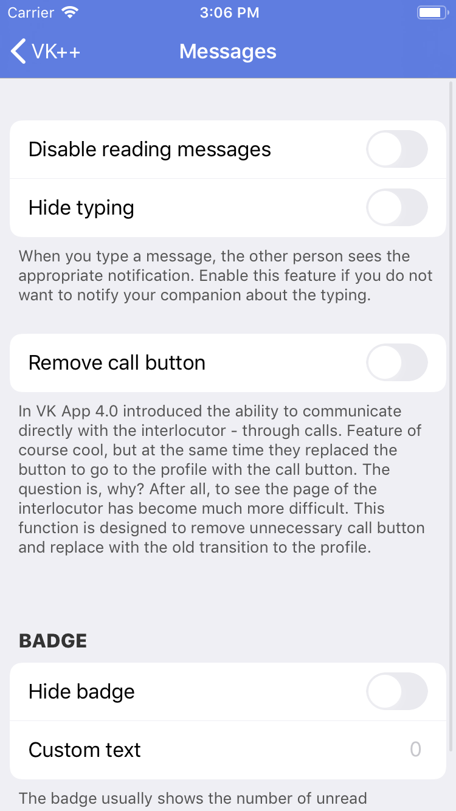
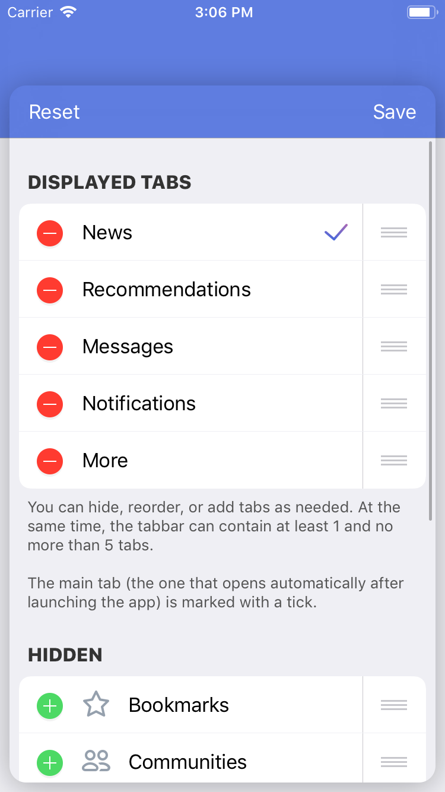
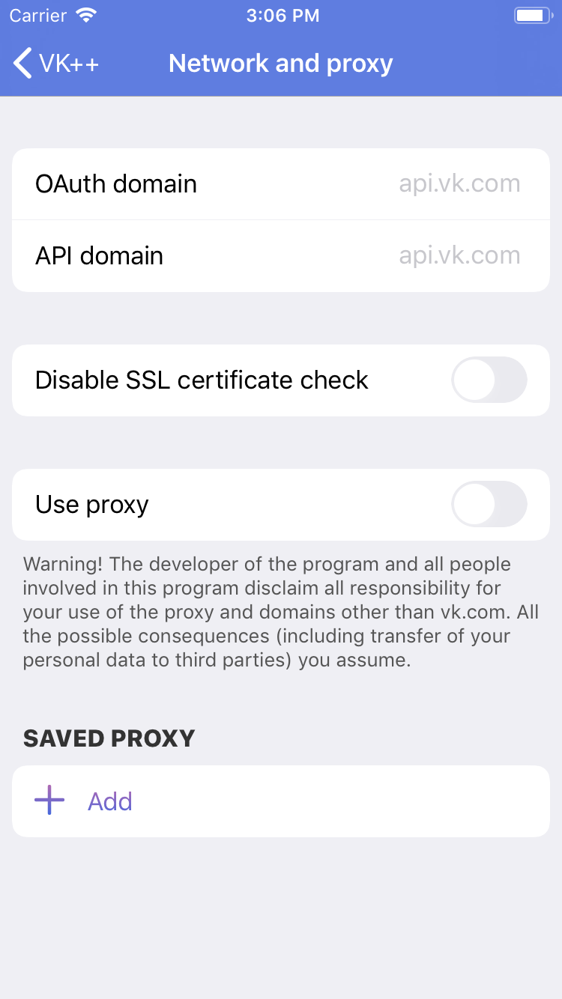

# VKPlus

## Description
**VKPlus or VK++ is a simple iOS tweak for VK App.** It has many useful features which improve usability of VK App. Though it has huge problems with architecture and performance, VKPlus still work. It now supports VK App 3.0 - 5.6.1 and iOS 9.0 - 12.1

## Features
As already said, VKPlus has many useful features. Among them:

* Completely disabling advertisments and unuseful features for newsfeed
* Disabling messages reading and typing
* Tabbar customisation. You can reorder, hide or add some buttons in tabbar
* Bypassing music 30-minute limite and music block in 3-party clients
* Built-in proxy to use VK App when your Internet provider blocks it
* Bypassing blacklist and containing erotic content pages (Apple restriction)

I'd like to implement more features like media downloader, multi-account support and other, but I don't have enough time and aspiration to do that.

## Screenshots

## Limitations
This public version has limited number of functions. It does't have music bypass because of VK user agreement. And it does't have icons because of designer has copyright on it.

## Licence
This tweak is available under MIT Licence. You can read [**LICENCE**](./LICENCE) for more info.
